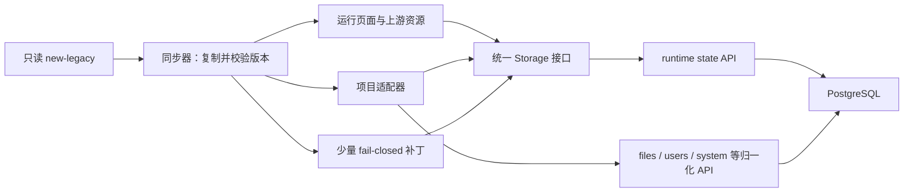

# 全角色缺陷修复设计

日期：2026-07-21  
状态：已确认采用方案 2（统一适配层 + 少量升级补丁）

## 1. 目标与边界

本轮修复 `docs/功能测试问题记录-2026-07-21.md` 中确认的 15 项问题，同时保持以下硬约束：

- `new-legacy/` 是只读上游版本，不直接修改。
- 运行页面的 DOM、className、CSS 和交互细节继续以 `new-legacy` 为唯一设计基线。
- PostgreSQL 是业务数据唯一持久化真值，浏览器存储只允许承担临时会话与同步缓存职责。
- 后续替换整个 `new-legacy/` 时，兼容补丁必须先校验再生成；结构不匹配时停止升级并保留当前版本。
- 修复不引入 React/new-legacy 混合页面。

## 2. 已确认的根因

### 2.1 存储替换器失效

当前同步脚本通过文本扫描把上游 JavaScript 中的 `localStorage` 替换为服务端存储适配器。扫描器不能正确识别正则表达式里的引号，导致 `65-question-bank-admin.js` 完全没有被改写。因此题库、题目和试卷仍写入浏览器本地存储，训练和回忆页也无法读取同一份后端数据。

### 2.2 图谱保存时序错误

图谱引擎的自动保存周期为三分钟。页面离开时，服务端存储适配器先发送旧快照，图谱引擎随后才把最新画布写入适配器，造成节点、位置和关系在刷新后丢失。

### 2.3 创建文件后的跳转竞争

“创建并打开”同步修改内存状态后立即跳转。新页面可能在后端保存完成前启动，因此读取到旧的当前文件。

### 2.4 角色与归一化接口未接入直接运行页

`/member` 的直接入口绕过了上游已有的角色判断；系统设置页只读写通用运行状态，没有与 `/api/v1/system/*` 形成同一真值。

### 2.5 其余问题属于上游交互缺口

取消新增节点、节点初始坐标、重复关系、空题保存、快捷栏遮挡和旧架构文案均能在上游运行逻辑或生成页面中稳定复现。它们不应通过修改 `new-legacy/` 解决，而应由可校验的项目补丁处理。

## 3. 总体架构

同步器只做三件事：复制上游、注入项目适配器、应用带源代码锚点校验的小补丁。任一必需锚点缺失都视为新版不兼容，构建失败，发布脚本不得切换 `current` 指针。

## 4. 修复设计

### 4.1 统一存储与跨页面数据

- `server-state-bootstrap.js` 在所有上游脚本执行前，将页面的 `window.localStorage` 代理到 `KGServerStateStorage`。
- 停止依赖 JavaScript 源码文本替换。这样未来上游新增的任何 `localStorage` 调用也会自动写入后端状态。
- `sessionStorage` 保持浏览器会话语义，不承载业务持久化数据。
- 适配器增加可等待的 `flush()`，只有服务端确认 revision 后 Promise 才完成。
- 保留并发 revision 检查；冲突时重新加载最新状态、合并本次键级修改并重试，避免多标签页静默覆盖。

该项解决：P1-03、P1-04、P1-05，并为所有上游页面提供统一的数据基础。

### 4.2 图谱与文件保存

- 新增图谱直接适配器，包装上游 `KGGraphFileAutosave.markDirty`，在最后一次画布修改后短延迟执行 `saveNow(force)`。
- 页面 `pagehide` 发送 beacon 前让当前事件中的上游保存处理器先完成，确保发送的是最新快照。
- “创建并打开”在跳转前 `await KGServerStateStorage.flush()`；失败时停留在当前页并显示上游风格错误提示。
- 保存状态继续使用上游现有视觉，不新增浮层或改变页面结构。

该项解决：P1-01、P1-02。

### 4.3 图谱交互修复

- 新增节点在用户确认前视为草稿；取消时删除草稿并恢复选中状态。
- 连续新增节点使用以画布中心为基准的阶梯偏移，并在达到边界后换行，避免完全重叠。
- 建立重复关系时保留原关系，不把重复操作解释为删除；使用原有提示区说明关系已存在。

实现优先通过暴露接口的项目适配器；只能修改闭包内部逻辑时，使用包含精确前置锚点和后置断言的生成补丁。

该项解决：P2-01、P2-02、P2-03。

### 4.4 题库校验与训练界面

- 题目保存前校验题干、选项数量和非空选项；错误使用现有表单错误样式并聚焦首个错误字段。
- 训练页快捷入口增加页面级响应式约束：不能覆盖主操作区，在窄高或 1440×1000 视口下移到安全位置或折叠为原有入口形态。
- 不改变训练主工作区的尺寸、字体和卡片结构。

该项解决：P1-06、P2-04。

### 4.5 角色、用户和凭据

- `/member` 只允许 student 进入套餐选择；admin/teacher 显示免订阅身份摘要，viewer 显示游客说明且无购买入口。
- 后端复制用户时将显示名规范为“原显示名 副本”，用户名仍按唯一性规则生成。
- 导出文件继续禁止包含密码哈希。
- 导入时管理员必须提供统一初始密码；后端按正常密码策略哈希保存，成功提示明确说明导入账号使用该初始密码。取消或不合法密码不会创建用户。

该项解决：P1-07、P1-08、P2-05。

### 4.6 系统设置单一真值

- 系统设置页面初始化时从 `/api/v1/system/*` 读取归一化配置。
- 保存时先调用对应归一化接口；成功后再同步 runtime state 中供上游即时读取的镜像键。
- API 保存失败时不更新运行时镜像，并使用页面原有提示反馈。
- 后端启动或历史数据迁移时，以归一化配置为准回填运行时镜像，避免两套配置长期分叉。

该项解决：P2-06。

### 4.7 文案修正

同步阶段只替换已确认的旧架构说明，改为“数据已同步至服务器”“支付能力按系统配置启用”等符合当前架构的文字。DOM 与样式不变；源文案锚点变化时构建失败并提示人工复核。

该项解决：P3-01。

## 5. 测试策略

所有修复遵循“先写失败测试，再实施，再回归”：

1. 生成器契约测试：上游业务脚本保持原始内容，必需适配器成功注入，补丁锚点缺失时构建失败。
2. 后端单元/接口测试：复制显示名、带初始密码导入、系统设置双写和权限边界。
3. 浏览器持久化测试：编辑后刷新、关闭上下文重登、跨页面题库→训练→回忆、创建并打开新文件。
4. 图谱交互测试：取消新增、连续新增坐标、重复关系计数。
5. 五角色矩阵：管理员、教师、两种程度学生、游客分别验证页面入口和 API 权限。
6. 视觉测试：重点比较图谱、题库、训练、会员、用户和设置页面；确认 DOM/className 不变，并检查 1440×1000 与移动端。
7. 完整门禁：后端 pytest、前端/同步器测试、TypeScript 构建、版本 inspect/update/rollback 隔离演练。

## 6. 升级与回滚

以后收到新的 `new-legacy/` 版本时执行：

1. 在隔离发布目录复制新版。
2. 执行版本识别、生成器契约测试和补丁锚点校验。
3. 运行后端、浏览器和五角色关键路径测试。
4. 全部通过后原子切换版本指针。
5. 任一步失败则保留当前线上版本，并输出不兼容文件、锚点和测试证据。

回滚只切换到上一个已验证发布目录，不回滚 PostgreSQL。涉及 schema 的未来升级必须提供向前兼容迁移，保证旧前端仍能读取新数据。

## 7. 验收标准

- 问题记录中的 15 项全部有自动化回归测试且通过。
- 业务修改在刷新、重新登录和新浏览器上下文中仍存在。
- 五个角色的页面与 API 权限一致。
- `new-legacy/` 工作树无修改。
- 同步生成失败不会覆盖当前可运行版本。
- 页面结构、className 和视觉细节与 `new-legacy` 保持一致，只有问题涉及的状态、提示和遮挡修复发生变化。
