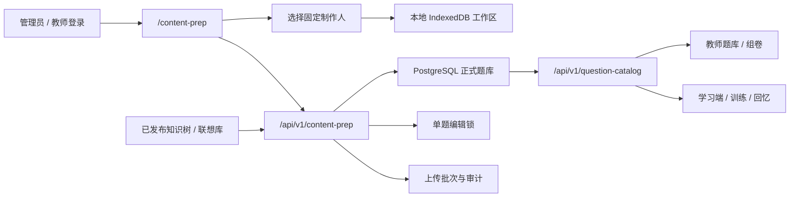

# Content Prep Studio 与正式题库数据库集成设计

日期：2026-08-09
状态：用户已确认
目标路由：`/content-prep`

## 1. 背景

仓库根目录的 `enterinformation/` 是一套外置的 PMP Content Prep Studio v0.4.0 交付包。它当前以单 HTML 运行，将本地工作区保存在独立 IndexedDB，并通过 JSON 文件与正式程序交换题库、原则、归纳卡和标签配置。它不属于 active release，也不参与当前 `new-legacy` 构建。

正式项目已经有 PostgreSQL 的 `question_banks`、`questions` 等表和基础 CRUD API，但当前线上 `new-legacy` 页面主要通过 `/api/v1/runtime/state` 同步浏览器状态，题库并未统一从关系表读取。现有 `questions` 表也不能完整保存 Prep Studio 的双语内容、知识映射、关键词系统、解题路径、来源与审计字段。

本设计将 Prep Studio 与主项目连接起来：题目从 Prep Studio 上传后立即写入 PostgreSQL，主项目通过统一 API 读取，不再需要人工导出和再次导入 JSON。

## 2. 已确认的产品决策

1. 上传成功后题目立即进入目标题库，不增加审核等待状态。
2. Prep Studio 可选择一个有权写入的已有题库，也可创建新题库；服务器题库 ID 保存在本地工作区中供后续同步使用。
3. 上传采用幂等同步：相同题目 ID 和相同内容跳过，相同 ID 但内容变化时更新，新 ID 新增；整批失败时全部回滚。
4. 保留现有六位固定制作人选择，暂不改为自动使用登录账号。
5. 页面必须先登录主项目，并具备题库访问、数据导入和题目编辑权限。
6. 登录账号负责认证、授权和操作审计；所选制作人负责内容署名。两者同时记录，互不替代。
7. 使用范围复用现有 `可公开 / 内部使用` 设置。未设置时按 `内部使用` 处理。
8. 私有题库优先级最高：私有题库里的题目即使标记“可公开”，学习端也不可见。
9. 公开题库里的“可公开”题目上传成功后可立即由学习端读取；“内部使用”题目仅管理端可见。
10. 保留 IndexedDB、本地工作区、自动保存、JSON 导入导出和离线新题制作能力。
11. 支持从数据库拉取已有题目继续编辑。
12. 并发采用单题编辑锁。同题库的不同题目可以并行编辑，同一道题同一时间只能有一个编辑者。
13. 完整内容包中的题库、题目、原则、归纳卡和标签配置在同一事务中同步。
14. 知识树与科目级联想库继续通过现有管理端独立维护和发布，上传时只校验引用。
15. PostgreSQL 关系表与统一题目 API 是唯一正式数据源，不采用 Runtime State 与关系表双写。

## 3. 目标与非目标

### 3.1 目标

- 为 Prep Studio 提供受保护的稳定路由和服务器模式。
- 完整、无损地保存 Prep Studio 题目结构。
- 让教师题库、学习端、组卷和训练从同一题目 API 读取。
- 实现题目级互斥编辑、幂等上传、事务回滚和可追溯审计。
- 保留本地制作体验和断网草稿保护。
- 安全迁移现有 Runtime State 与现有关系表中的题库数据。

### 3.2 非目标

- 不取消或重做现有六位制作人选择界面。
- 不在本次集成中重构知识树和联想库的管理发布流程。
- 不把 Prep Studio 拆成独立微服务、独立域名或独立账号体系。
- 不同时维护 Runtime State 题库和关系表题库两份主数据。
- 不改变当前题目内容编辑流程、主题、帮助中心和 JSON 备份能力。
- 不在本次集成中引入机构、租户或班级级权限模型。

## 4. 总体架构



Prep Studio 与主项目部署在同一个 FastAPI 服务和同一个站点源下，复用 `kg_session` Cookie，不引入跨域认证。`/content-prep` 返回 active release 内的正式页面，页面 API 使用相对路径。

正式源码不从当前被忽略的 `enterinformation/` 直接提供。实施时应将模块化源码纳入受版本控制的正式源目录，通过现有发布管理器构建并进入 active release。根目录交付包保留为来源材料或验收基线。

## 5. 权限模型

### 5.1 页面和 API 双重校验

- `GET /content-prep`：必须登录，并具备 `accessQuestionBank`、`importData`、`editQuestions`。
- 所有 `/api/v1/content-prep/*` 写接口再次执行后端权限校验。
- `admin` 可管理所有题库、查看全部锁并强制解锁。
- `teacher` 只能写入自己拥有或被授权协作的题库。
- `student`、`viewer` 无权访问 Prep Studio 或写接口。
- 前端隐藏按钮只能改善体验，不能替代后端校验。

### 5.2 制作人与登录账号

服务器维护与现有前端一致的六位制作人 allowlist。请求提交 `creatorId`，服务器根据 allowlist 写入规范名称，拒绝未知或篡改的制作人信息。

每次创建、更新、锁定和上传同时记录：

- `actor_username`：真实登录账号。
- `actor_role`：操作时角色。
- `creator_id`、`creator_name`：用户在 Prep Studio 中选择的制作人。
- `client_instance_id`：当前浏览器工作区实例，用于锁和幂等重试。

## 6. 数据模型

### 6.1 `question_banks`

保留现有字段并补充：

- `revision`：整数修订号，每次题库元数据变化后递增。
- `created_by`、`updated_by`：登录账号。
- `visibility` 使用规范值 `private`、`published`；历史 `public-demo` 保留为只读演示兼容值。

新增 `question_bank_collaborators`：

- `bank_id`、`username` 组成唯一约束。
- `permission` 取值 `view` 或 `edit`。
- 记录授权人和授权时间。

### 6.2 `questions`

保留已有可检索标量列，并增加或补齐：

- 标量：`teacher_number`、`scope`、`content_hash`、`creator_id`、`creator_name`、`created_by`、`updated_by`、`revision`。
- JSONB：`translations`、`metadata`、`key_path`、`lifecycle`。
- 继续使用 JSONB：`tags`、`stem_parts`、`options`、`clues`、`concepts`、`reasoning_steps`、`status`。

约束：

- Prep Studio 新建题目必须使用其生成的 UUID 作为主键，服务器不替换 ID。迁移得到的历史非 UUID 稳定 ID 原样保留，不在迁移时重编号。
- `scope` 只取 `public` 或 `internal`，未识别或缺失时写入 `internal`。
- 同时出现“可公开”和“内部使用”时按 `internal` 处理。
- `content_hash` 由服务器对规范化题目内容重新计算，不直接信任客户端值。
- 同一题库内可对 `content_hash` 建索引用于重复检测，但不禁止不同题库包含相同内容。
- 已存在的题目 ID 不能通过上传被移动到另一个题库；跨题库复用必须复制为新 UUID。
- `status.published` 不作为独立公开真值；学习端可见性由题库 `visibility` 与题目 `scope` 共同决定。

### 6.3 原则、归纳卡与标签配置

- `principles`：稳定 ID、名称、状态、易混淆原则、修订号、创建/更新账号和时间。
- `synthesis_presets`：稳定 ID、`principle_id` 外键、标题、内容、状态、业务版本、修订号。
- `question_tag_configs`：版本化保存标签名称、分组、分类、别名和语义槽位映射；同一时间只有一个 active 配置。

题目通过 `metadata.principleIds`、`metadata.optionPrincipleMap` 和 `metadata.tagPaths` 保留当前前端契约。上传事务必须验证所有原则 ID 和标签路径。原则、归纳卡与标签按稳定 ID upsert，不执行未声明的删除。

### 6.4 编辑锁

新增 `question_edit_locks`：

- `question_id` 为主键，确保一题最多一个有效锁。
- `locked_by`、`creator_id`、`creator_name`。
- `client_instance_id`。
- `token_hash`：服务器只保存锁令牌摘要。
- `acquired_at`、`heartbeat_at`、`expires_at`。

锁令牌只返回给获得锁的会话。更新已有题目必须同时提供锁令牌和题目 revision。

### 6.5 上传批次与审计

`question_upload_batches` 保存：

- 服务器批次 ID、客户端幂等键、目标题库 ID。
- 登录账号、制作人、应用版本、客户端实例。
- manifest hash、输入数量、新增/更新/跳过数量。
- `pending`、`committed`、`rolled_back` 状态。
- 校验和结果摘要。

同一登录账号和同一幂等键重复请求返回第一次的已提交结果，不重复写入。

`question_audit_logs` 为只追加记录，覆盖题目创建、修改、锁定、释放、过期、强制解锁和批量上传。审计至少保存实体 ID、操作类型、登录账号、制作人、时间、批次 ID、修改前后 hash、revision 和结果；普通教师不能修改或删除审计记录。

## 7. API 设计

### 7.1 统一读取 API

命名空间：`/api/v1/question-catalog`

- `GET /banks?mode=writable`：Prep Studio 可写题库。
- `GET /banks?mode=managed`：教师题库列表。
- `GET /banks/{bank_id}/questions`：分页查询题目摘要。
- `GET /questions/{question_id}`：读取完整题目和当前 revision、锁状态。
- `GET /learning/questions`：按科目、题库、试卷等条件返回学习端可用题目。

学习端查询必须在服务器执行可见性过滤：

```text
bank.visibility == published
AND question.scope == public
AND question.lifecycle.status == active
```

现有订阅、试卷授权和角色策略继续在该过滤结果之上执行。

### 7.2 Prep Studio 写入 API

命名空间：`/api/v1/content-prep`

- `POST /locks/{question_id}`：获取单题编辑锁。
- `PUT /locks/{question_id}/heartbeat`：续期。
- `DELETE /locks/{question_id}`：主动释放。
- `DELETE /locks/{question_id}/force`：管理员强制释放。
- `POST /banks`：创建题库并返回数据库 ID、revision。
- `POST /batches`：事务化上传题库内容包。
- `GET /batches/{batch_id}`：查询幂等上传结果。
- `PUT /questions/{question_id}`：保存单题，必须提供锁令牌和 base revision。

`POST /batches` 请求包含：

- `idempotencyKey`、`clientInstanceId`、`targetBankId`。
- `creatorId`、Prep Studio 版本、工作区版本。
- 题目列表及已有题目的 base revision、锁令牌。
- 原则、归纳卡和标签配置的增量内容。

响应按题目返回 `created`、`updated` 或 `skipped`，并返回服务器题库 ID、题目 ID、revision、规范 content hash 和批次 ID。客户端只在收到成功响应后更新本地同步状态。

## 8. 上传事务与幂等规则

单个上传请求在一个数据库事务中执行：

1. 验证登录、角色权限和题库协作权限。
2. 校验制作人 allowlist、请求结构和幂等键。
3. 锁定目标题库及相关配置 revision。
4. 验证更新题目的编辑锁、锁令牌和 base revision。
5. 校验题目内容、选项、正确答案和 UUID。
6. 校验知识点和联想节点是否存在于当前已发布内容中。
7. upsert 原则、归纳卡和标签配置，并校验引用。
8. 对题目生成服务器规范 content hash。
9. 相同 ID、相同 hash：`skipped`。
10. 相同 ID、hash 变化：更新并递增 revision。
11. 新 ID：新增，revision 从 1 开始。
12. 写入上传批次结果和审计。
13. 在同一事务中删除本批已保存题目的编辑锁；事务提交时锁与内容一起生效，事务回滚时原锁保持有效。

任何一步失败都回滚全部业务写入。失败的批次状态和错误摘要在独立短事务中记录，不能留下部分原则、配置或题目。

## 9. 单题编辑锁行为

- 打开数据库已有题目的编辑模式前必须在线获取锁。
- 获锁后前端每 30 秒发送一次心跳。
- 最后一次有效心跳 5 分钟后锁自动过期。
- 保存成功、退出编辑、切换工作区或明确取消时主动释放。
- 其他用户打开被锁题目时进入只读模式，显示锁定登录账号、所选制作人和锁定时间。
- 管理员强制解锁后，原编辑者的旧令牌立即失效，后续保存返回 `409`。
- 获取锁和清理过期锁使用数据库行锁或原子冲突写入，不能依赖进程内内存锁，以支持多进程部署。

锁是主要并发控制；revision 是防止过期锁、异常重试或管理员强制解锁后的二次保护。

## 10. 本地工作区与断网行为

保留现有 IndexedDB 工作区和 JSON 备份能力。工作区新增服务器同步元数据：

- `serverBankId`、`serverBankRevision`。
- 每题 `serverRevision`、`serverContentHash`、`lastSyncedAt`。
- `clientInstanceId` 和最近一次幂等键/批次 ID。

行为规则：

- 未上传的新题可离线创建和编辑。
- 数据库已有题目必须在线取得锁后才能进入正式编辑模式。
- 编辑过程中断网时继续把本地变化保存到 IndexedDB，但界面明确显示“仅本地保存，未同步”。
- 恢复网络后先续期或重新获取原锁，再尝试保存。
- 如果锁已被其他用户取得，本地修改不能覆盖服务器；用户可复制为新题或导出 JSON。
- 网络超时重试沿用同一幂等键，避免用户重复点击产生重复题。

## 11. `new-legacy` 接入策略

新增题目 API 适配层，为现有页面输出当前期望的 question bank JSON 结构，避免一次性重写所有学习页面。

- 教师题库页面通过 API 获取可管理题库和题目，写操作直接调用服务器。
- 学习、训练、回忆和试卷页面通过 catalog API 或其内存缓存读取题目。
- 题目可存在页面会话内存缓存，但不得作为另一份持久化主数据写入 Runtime State。
- 现有 `kg_question_banks_v1__*` 与 `kg_question_banks_published_v1` 仅在迁移阶段读取；迁移完成后从 Runtime State 可写白名单中移除或拒绝写入。
- 学习进度、界面偏好等非题目数据继续使用 Runtime State，不受本设计影响。

## 12. 页面与发布

- 新增稳定路由 `GET /content-prep`。
- 页面复用现有 SessionMiddleware 认证和相对路径 API。
- 未登录重定向到现有登录入口；无权限返回项目统一的 403 页面。
- Prep Studio 保留原有页面布局和制作流程，只增加服务器状态、目标题库选择、同步按钮、锁状态和冲突提示。
- 正式页面及其资源必须进入 `new-legacy` source、候选 site 和 active release，不从被忽略目录直接 serve。
- 正式发布使用 `node frontend/scripts/manage-new-legacy.js update new-legacy --skip-browser` 或当期规定的完整校验流程，不手工覆盖 release site。
- 发布前必须核对候选 site 与当前 active release 文件数，并确认 `/content-prep`、题库页面和关键学习页面存在。

## 13. 错误处理

- `401`：未登录或会话失效，保留本地草稿并提示重新登录。
- `403`：缺少页面、题库或写入权限。
- `404`：题库、题目或已发布引用不存在。
- `409`：编辑锁冲突、revision 冲突、幂等键载荷冲突或配置 revision 冲突。
- `422`：内容结构、引用、标签、原则或答案校验失败。
- `503`：数据库或正式内容依赖暂不可用。

错误响应包含稳定错误码、用户可读信息、批次 ID，以及可定位到具体题目/字段的 `issues` 数组。前端不得在失败响应后显示“上传成功”，也不得清空 IndexedDB 草稿。

## 14. 数据迁移

迁移来源包括：

1. 现有关系表 `question_banks/questions`。
2. 各用户 Runtime State 中的 `kg_question_banks_v1__*`。
3. 共享 Runtime State 中的 `kg_question_banks_published_v1`。

迁移流程：

1. 对三类来源创建只读快照并记录 hash、数量和时间。
2. 先执行 dry-run，生成题库、题目、重复项、缺失引用和冲突报告。
3. 按稳定题库 ID、题目 ID和规范 content hash 合并。
4. 同 ID、同 hash 合并为一条；同 ID、不同 hash 不静默覆盖，阻止正式切换并输出冲突清单。
5. 为已有私有题库设置原 owner，为共享题库保留发布可见性并补齐管理者。
6. 迁移完成后比对题库数、题目数、公开/内部数量和抽样完整字段。
7. 验证通过后切换主项目读取 API，并禁止 Runtime State 正式题库写入。
8. 快照保留到完成至少一次生产回滚演练和验收，不在迁移脚本中删除原数据。

## 15. 测试与验收

### 15.1 后端测试

- 页面路由、Session 和角色/权限校验。
- 题库 owner、协作者和管理员边界。
- 完整 Prep Studio 字段往返无损。
- 公开/内部映射与学习端过滤。
- 新增、更新、跳过和整批回滚。
- 幂等重试及同幂等键不同载荷拒绝。
- 原则、归纳卡、标签配置事务同步。
- 知识点和联想节点引用校验。
- 单题锁获取、冲突、心跳、过期、释放和管理员强制解锁。
- revision 与锁令牌双重防覆盖。
- 服务器 content hash 重算和审计记录。
- 迁移 dry-run、冲突检测和可重复执行。

### 15.2 前端和浏览器测试

- 未登录、无权限、管理员和教师访问 `/content-prep`。
- 六位制作人选择保持原行为。
- 选择已有题库、创建新题库和记住服务器题库 ID。
- 新题上传后教师题库无需 JSON 导入即可立即看到。
- 公开题目可进入学习端，内部题目不可见。
- 两个浏览器账号不能同时编辑同一道题，但可编辑同题库不同题目。
- 断网、本地草稿、恢复连接和幂等重试。
- 锁被抢占或强制释放后旧页面不能覆盖。
- JSON 导入导出和本地工作区功能无回归。
- Prep Studio → 教师题库 → 训练/回忆的完整链路。

### 15.3 发布验收

- 后端测试集通过。
- new-legacy 合同测试与浏览器回归通过。
- 候选 release 文件数量不低于当前 active release，关键页面和新增页面存在。
- 预览版本中完成管理员和教师两类账号的端到端烟测。
- 数据迁移报告无未处理冲突后才能切换正式读取路径。

## 16. 实施顺序

1. 新增数据库迁移、模型和领域服务。
2. 实现 catalog 读取 API、权限过滤和相关后端测试。
3. 实现 Prep 写入 API、幂等批次、审计和单题锁。
4. 将 Prep Studio 模块化源码纳入正式源并接入 Session、题库选择、拉取、锁和上传。
5. 实现 `new-legacy` 题目 API 适配层，先切换教师端，再切换学习端和试卷链路。
6. 编写并 dry-run 数据迁移，处理冲突。
7. 禁止 Runtime State 写正式题库，运行全量测试。
8. 构建候选 release、预览验收、文件数核对后 promote。

## 17. 成功标准

- Prep Studio 上传成功后，目标题库 API 立即返回同一题目。
- 主项目不再要求人工导入 Prep Studio 导出的题库 JSON。
- 正式题目只存在一个权威数据源。
- 题目完整字段、制作人、登录账号、批次和审计均可追溯。
- 重复请求不重复写入，失败批次不产生部分数据。
- 同一道题不会被两个账号同时编辑或被过期页面覆盖。
- 公开范围符合题库可见性与题目使用范围的组合规则。
- 本地草稿和离线新题能力继续可用。
