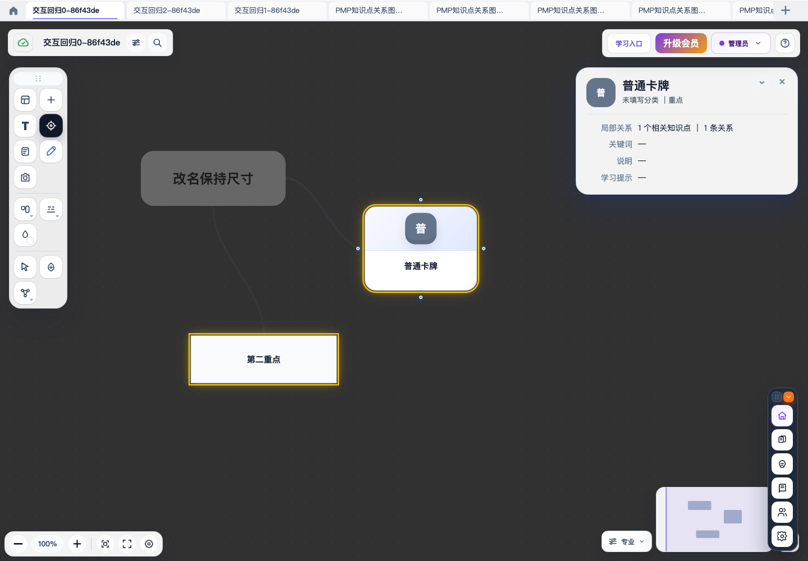
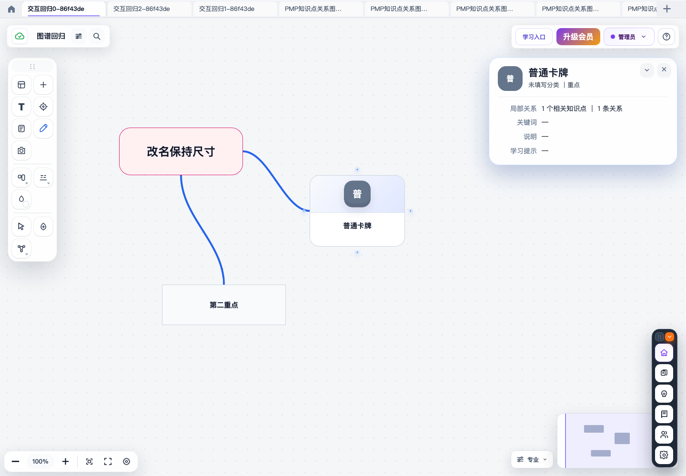

# 图谱交互与聚焦修复

状态：已部署 UAT v9.0-p4.1.308，开发自检和线上功能复测通过，等待用户本人验收，基于 uat cd2d18f0，新分支 codex/graph-interaction-focus-fixes；用户要求修复后回归并部署 UAT，等待本人验收，不合入 main。

| 需求 | 实现与验证范围 |
| --- | --- |
| 页签拖拽 | 服务器文件索引排序、数据库持久化、owner隔离、失败恢复、刷新/登录后顺序 |
| 编辑保持尺寸 | 专业模式只更新实际变化字段，保留几何/手动样式；取消、撤销/重做、显式尺寸变更 |
| 聚焦视觉 | 暗画布、暗非重点、亮重点+黄色光晕，退出还原；自定义背景、卡片样式和性能模式 |
| 重点来源 | 严格使用学习标记“重点”，保存后即时更新，其他标记不误高亮 |
| 连线中点 | 卡牌中心主方向决定边的中点，水平/垂直/斜向/窄间距/移动缩放，保留人工曲线控制点及自由端点 |

## 根因与进度

- 页签：拖拽错误调用旧 local store，remote API 尚无持久排序入口；复用现有 order_index。
- 编辑：完整编辑无条件把 size 传给 updateAppearance，引发显式尺寸重置语义。
- 聚焦：统一画布背景及首页性能 CSS !important 覆盖原 focus 暗化和光晕，并与心流关系高亮叠加。
- 连线：矩形边框使用中心射线交点导致端点分散；改为中心主方向边中点，默认路径切线使用相同主方向。
- 连线测试先 RED（端点 y=60.95，预期40），再 GREEN。其他分项证据见 artifacts/graph-interaction-focus-fixes/*-report.md。

## 开发验证

- 真实 Chrome + 隔离数据库综合流程全部通过：实际拖拽排序/刷新、503失败不改序与重试、专业模式编辑内容保留完整几何和样式、API及重载一致、取消和撤销重做、重点标记即时更新/重载、退出聚焦、拖动卡牌后的连线中点与持久化。
- 聚焦 CSS 实测：2主题×3背景，6卡型×4交互/性能状态，退出恢复和工具栏可用。
- 模态框定向9项通过；排序API4项通过；前端排序覆盖并发刷新/修改、owner切换、失败恢复。
- 复审发现并修复两项边界问题：排序完成时丢弃并发元信息刷新；宽卡斜向排列时主轴范围重叠导致默认连线穿牌。两项均有先失败后通过的回归，最终复审无剩余阻断项。
- 连线覆盖镜像水平/垂直/斜向/1px次轴空隙、默认路径不穿牌、控制点优先、完整绕行路径平移/重绑/取消/JSON重载一致。
- 原离线 p4330 浏览器fixture业务断言通过，但其console检查受微信配置API不可达影响；真实API综合回归无页面脚本异常。

## 兼容边界

边线中点用于矩形卡牌；圆形、三角形保留实际轮廓锚点。手工设置的控制点/折点优先；显式直线仍是一条直线，卡牌实际相交或没有绕行空隙时不承诺自动避障。新绕行逻辑适用于默认曲线和折线。

## 发布与线上验证

- 代码提交：`71d81c3873ac1b988f5d16dec37a6ca53bc02996`；先合入并推送 uat，再经 `bash deploy/update-uat.sh` 完整门禁部署。
- 后端：971 passed（3 warnings）；前端：317/317，9个Python契约、10个扩展契约及部署脚本检查通过。
- 浏览器门禁：核心做题、画布墨迹27项、首页工具、文件管理搜索与多页签、此次图谱交互、内容准备、订阅、资源和跨页面检查全部通过。
- 既有桌面/移动端4组视觉基线差异均0.000%。完整门禁770秒，部署833秒，最终退出码0。
- 发布文件清单：原active1046个、候选1051个，仅新增5个测试文件，没有删除文件；关键页面齐全。
- UAT公网版本 `v9.0-p4.1.308`，健康检查和服务就绪检查通过。公网7个关键JS/CSS资源SHA-256与本地不可变release完全一致。
- UAT真实Chrome（默认无头及有窗口）复测全部通过：真实拖拽持久排序/503失败恢复，专业模式内容编辑保持几何/样式及撤销重做，重点标记变化/聚焦切换，连线随拖动更新且刷新保留。
- 每轮使用3个临时测试图谱，按记录的精确ID清理；核对原有文件顺序、当前文件及全部内容revision保持一致。
- 额外检查聚焦截图中文字绘制：DOM文本、可见性及布局数据正常；单独聚焦流程的开启/退出/延迟截图中，普通卡牌与第二重点卡牌文字区分别均有310/263个深色字形像素。完整流程重复检查同样为310/263，原始冻结截图像素也一致；最初目视疑问未得到像素证据支持，不属于已复现的页面漏字故障。
- 证据日志在 `artifacts/graph-interaction-focus-fixes/`，全量日志在 `frontend/new-legacy-releases/v9.0-p4.1.308/validation-run.log`。
- 本地及远端 main 均保持 `7a24be322c4c560cc340ba1fdc4423d19a63df89`；没有合入或推送main，功能分支保留。

## 待用户验收

https://uat.aihuanpu.com 。用户明确验收通过前停止在UAT阶段。

UAT聚焦截图：

